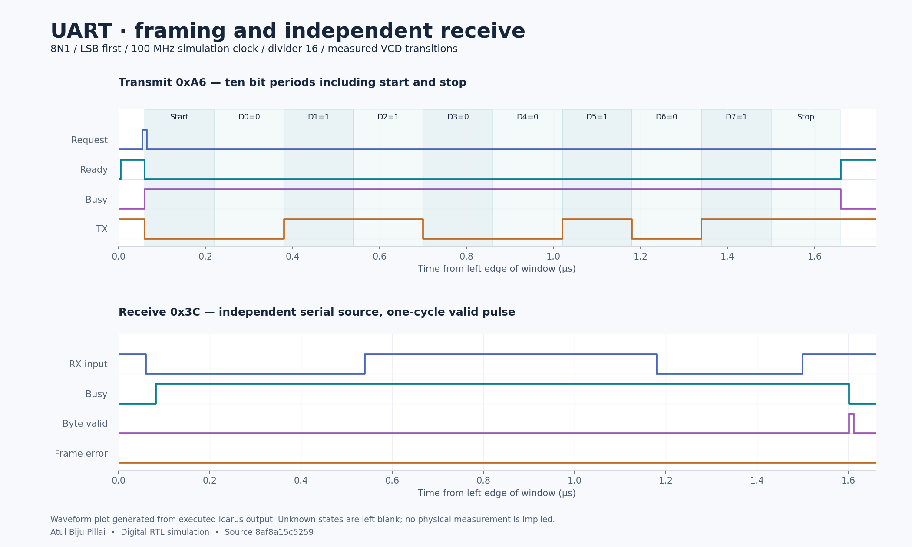
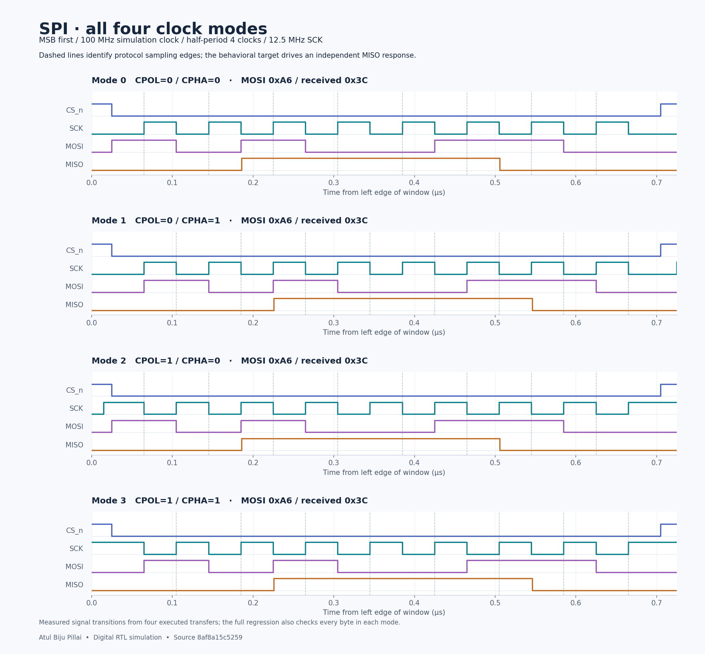
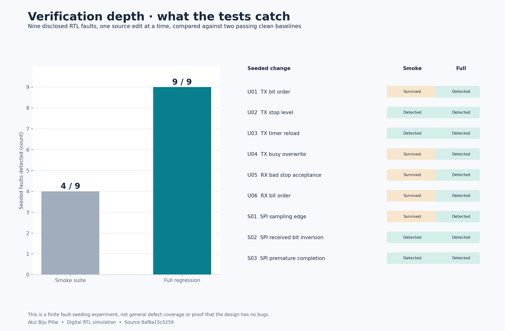

# UART/SPI verification evidence

Project owner: **Atul Biju Pillai**. These plots are generated from executed RTL simulations.

[Design and run instructions](https://github.com/AtulBPillai/uart-spi-verification-lab) · [Source commit](https://github.com/AtulBPillai/uart-spi-verification-lab/commit/8af8a15c5259af2a0c6e36de1b241f307914cd98)

# Executed simulation results

Project owner: Atul Biju Pillai.

Evidence type: digital RTL simulation; no FPGA or physical-chip measurements.

Source commit: `8af8a15c5259af2a0c6e36de1b241f307914cd98`

## Clean regression

| Run | Outcome | TX frames / SPI transfers | RX frames | Checks |
| --- | --- | ---: | ---: | ---: |
| uart-full-div16 | PASS | 258 | 260 | 422426 |
| uart-full-div17 | PASS | 258 | 260 | 448614 |
| uart-full-div32 | PASS | 258 | 260 | 841450 |
| spi-full | PASS | 3077 | — | 319990 |
| uart-smoke | PASS | 1 | 1 | 1321 |
| spi-smoke | PASS | 1 | — | 91 |

## Seeded RTL faults

| Fault | Change | Smoke suite | Full suite |
| --- | --- | --- | --- |
| U01 | Reverse TX payload bit order | SURVIVED | DETECTED |
| U02 | Drive a LOW stop bit | DETECTED | DETECTED |
| U03 | Reload TX timer one count too high | DETECTED | DETECTED |
| U04 | Accept a new TX request while busy | SURVIVED | DETECTED |
| U05 | Accept an invalid LOW stop bit | SURVIVED | DETECTED |
| U06 | Reverse RX payload bit order | SURVIVED | DETECTED |
| S01 | Sample MISO on the opposite edge | SURVIVED | DETECTED |
| S02 | Invert each received MISO bit | DETECTED | DETECTED |
| S03 | End SPI transfer one edge early | DETECTED | DETECTED |

DETECTED requires a successfully compiled mutant and a failing simulation assertion. Compile errors, missing pass markers and host timeouts are reported separately. Detection of these nine disclosed mutants is not proof of freedom from bugs. Coverage bins are planned functional scenarios, not RTL line/toggle coverage.
