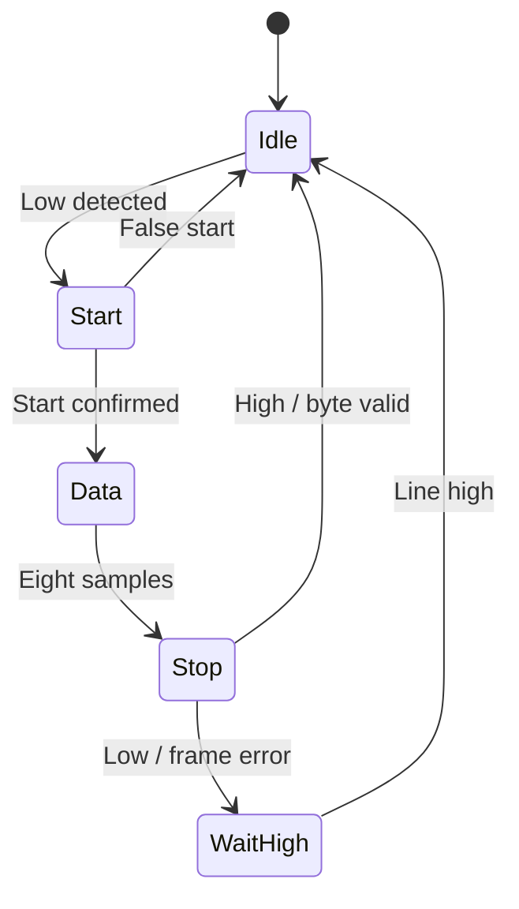

# Protocol and integration specification

## Common clock, reset and handshake

Every RTL state register uses the positive edge of `clk`. `rst` is synchronous and active high. Hold reset through at least one positive clock edge. The testbenches use a 10 ns system-clock period.

TX and SPI accept a request on a clock edge where `valid && ready` is true. Present stable payload/configuration before that edge and deassert `valid` after acceptance. A held-high `valid` can request another transfer after the controller becomes ready again. There is no request FIFO. Pulses of `valid` while `ready` is low are ignored.

`done`, RX `valid`, RX `framing_error` and SPI `config_error` are status events lasting one system-clock cycle for an individual operation. A continuously asserted invalid SPI request can produce consecutive error events, so an integrator should pulse or handshake requests rather than treating an error output as a queued record.

## UART transmitter

| Port | Direction | Meaning |
| --- | --- | --- |
| `clk`, `rst` | In | System clock and synchronous reset |
| `valid`, `data[7:0]` | In | Request and byte to transmit |
| `ready` | Out | Can accept a request, low during reset or a frame |
| `tx` | Out | Idle high; start low; D0 through D7; stop high |
| `busy` | Out | A frame is in progress |
| `done` | Out | The complete stop-bit duration has elapsed |

`CLKS_PER_BIT` is a compile-time integer divider. The supported integration contract is `CLKS_PER_BIT >= 16`; the regression checks 16, 17 and 32. Other divider values require additional validation for the intended serial timing and clock tolerance.

`baud = f_clk / CLKS_PER_BIT`. A frame takes exactly `10 × CLKS_PER_BIT` clock periods from acceptance to completion. The stop bit occupies a complete bit period. Example arithmetic: a 100 MHz input clock and divider 868 gives approximately 115,207 baud; this is a configuration calculation, not a hardware measurement or a tested configuration in the default suite.

Payload order for `0xA6` is start `0`, data `0,1,1,0,0,1,0,1`, stop `1`.

## UART receiver

| Port | Direction | Meaning |
| --- | --- | --- |
| `rx` | In | Asynchronous serial input, idle high |
| `data[7:0]` | Out | Most recent successfully received byte |
| `valid` | Out | Byte event; consume `data` on this pulse |
| `framing_error` | Out | Stop-bit sample was low; no valid byte emitted |
| `busy` | Out | Start/data/stop processing or waiting for break recovery |

A two-flop synchronizer feeds the receiver FSM. A low input is rechecked after approximately half a bit period to reject a short false start. Eight payload samples follow, spaced one bit period apart. A high stop-bit sample emits the byte. A low stop-bit sample emits a framing error and waits for the synchronized line to return high before arming for a new frame.

Reset from any state returns to Idle and suppresses partial-frame completion. There is no parity checker, FIFO, majority-vote sampler or receive backpressure. The consumer must capture each one-cycle event. The synchronizer delays observable events; this is not a zero-latency receiver. Back-to-back frames are explicitly tested at each configured nominal divider.

The small bit-period offsets in the tests do not establish a universal clock-error tolerance specification. No analog jitter, metastability resolution, voltage or rise-time model is simulated.

## SPI controller

| Port | Direction | Meaning |
| --- | --- | --- |
| `valid`, `tx_data[7:0]` | In | Transfer request and MSB-first output byte |
| `cpol`, `cpha` | In | Clock mode, latched at acceptance |
| `half_period[15:0]` | In | Number of system clocks per SCK half-period; minimum 2 |
| `miso` | In | Target data, sampled on the configured sample edge |
| `ready`, `busy`, `done` | Out | Request/transfer status |
| `config_error` | Out | Rejected request with half-period 0 or 1 |
| `sck`, `mosi`, `cs_n` | Out | Serial clock, controller data and active-low chip select |
| `rx_data[7:0]` | Out | Assembled response, valid when `done` pulses |

Set CPOL during idle and allow one system-clock edge for SCK to settle before issuing a request. Other request inputs must meet normal setup/hold at the acceptance edge. Configuration changes while busy do not affect the accepted transfer. SCK may follow a newly requested CPOL again after completion while CS is inactive.

| Mode | CPOL | CPHA | SCK idle | Sample | Launch |
| --- | ---: | ---: | --- | --- | --- |
| 0 | 0 | 0 | Low | Rising | Falling |
| 1 | 0 | 1 | Low | Falling | Rising |
| 2 | 1 | 0 | High | Falling | Rising |
| 3 | 1 | 1 | High | Rising | Falling |

`f_SCK = f_clk / (2 × half_period)`. The default waveform run uses half-period 4 with a 100 MHz simulation clock, giving 12.5 MHz SCK. Sixteen SCK edges transfer eight bits. CS-to-first-edge setup and final-edge-to-CS-release hold are each one half-period, so CS is active for `17 × half_period` system-clock periods.

For CPHA=0, the first MOSI bit is preloaded when CS asserts; the target must likewise preload the first MISO bit before the first sample edge. For CPHA=1, the first bit launches on the first SCK edge. The behavioral target drives MISO 1 ns after each launch edge and the controller samples at the following sample edge.

MISO is synchronous to the generated SCK transaction and must satisfy board-level timing relative to the system sampling edge. A UART-style two-flop MISO synchronizer is not inserted because it would change the sample phase. All internal state uses `clk`; SCK is an output, not an internal generated clock domain.

Reset aborts a transfer, deasserts CS, sets SCK low and clears pending completion. A real target may need a separate recovery sequence after an interrupted word. The design provides a controller, not synthesizable target/slave logic.
